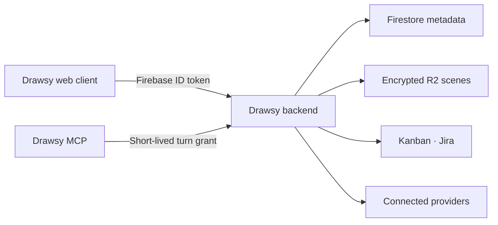

# Drawsy AI Backend

Authenticated workspace, resource, and connector control plane for Drawsy AI. It coordinates Firebase identity, Firestore metadata, encrypted Cloudflare R2 scenes, Kanban/Jira resources, provider OAuth, and read-only connected-source execution without replacing the Excalidraw editor core.

> **Repository status:** private for now. It is shared directly with OpenAI Build Week judges and may be published after a dedicated security and release review. No license is granted by repository access alone.

## Product role



The browser proves user identity with Firebase. This service then enforces ownership, membership, version, capability, and provider boundaries. Provider credentials remain server-side; the Drawsy MCP receives only narrowly scoped, expiring grants.

## OpenAI Build Week 2026

This service existed before the July 13, 2026 submission window. Only the changes after the official 9:00 AM PT cutoff are claimed for Build Week.

- **Boundary commit:** [`e75fc9f`](https://github.com/adarshnagrikar14/drawsy-ai-backend/commit/e75fc9f687361abf077912953729561174095d75)
- **First qualifying commit:** [`99e4e8a`](https://github.com/adarshnagrikar14/drawsy-ai-backend/commit/99e4e8ad1fef7d261073c0d15f8602da456eedaa)
- **Evidence range:** [`e75fc9f...main`](https://github.com/adarshnagrikar14/drawsy-ai-backend/compare/e75fc9f687361abf077912953729561174095d75...main)

Qualifying work includes turn-scoped connector and first-party resource grants, normalized provider execution, granular Google/GitHub/Notion/Slack tools, GitHub App installations, official Read AI and Fireflies remote MCP clients, read-only AWS cross-account inventory, Kanban ordering fixes, deployment packaging, and focused integration tests.

Codex running GPT-5.6 accelerated the service design, provider research, TypeScript implementation, test coverage, and deployment debugging. The product owner chose the authorization model: sources are explicit per turn, credentials never enter the model runtime, Jira remains read-only, Kanban mutations reuse normal board permissions, and AWS access is inventory-only.

The main product record and complete repository set are documented in [`excal-ai`](https://github.com/adarshnagrikar14/excal-ai) under its **#Build Week Special** section.

## Current API

- `GET /health` - public service health
- `GET /v1/me` - verifies a Firebase ID token and returns its normalized user
- `GET /v1/workspace` - lists the user's project and canvas metadata
- `GET /v1/canvases/:id/scene` - loads an authorized canvas scene
- `PUT /v1/projects/:id` - creates or updates a versioned project
- `DELETE /v1/projects/:id?baseVersion=N` - deletes a project and its canvases
- `PUT /v1/canvases/:id` - creates or updates a versioned canvas and R2 scene
- `PATCH /v1/canvases/:id` - updates canvas metadata without rewriting its scene
- `DELETE /v1/canvases/:id?baseVersion=N` - deletes a canvas
- `GET /v1/canvases/:id/comments` - lists the owner's private comments
- `POST /v1/canvases/:id/comments` - creates a private comment
- `DELETE /v1/canvases/:id/comments/:commentId?baseVersion=N` - deletes a comment

### Kanban

- `GET /v1/kanban/boards` - lists authorized boards
- `POST /v1/kanban/boards` - creates an encrypted board
- `GET /v1/kanban/boards/:id/snapshot` - loads the canonical board
- `GET /v1/kanban/boards/:id/changes?afterRevision=N` - loads bounded deltas
- `GET /v1/kanban/boards/:id/events` - authenticated SSE revision/role stream
- `POST /v1/kanban/boards/:id/commands` - applies ordered idempotent commands
- `GET /v1/kanban/boards/:id/members` - lists members
- `PATCH /v1/kanban/boards/:id/members/:userId` - changes editor/viewer role
- `DELETE /v1/kanban/boards/:id/members/:userId` - removes access or leaves
- `POST /v1/kanban/boards/:id/ownership-transfer` - transfers ownership after recent authentication
- `POST /v1/kanban/boards/:id/invitations` - creates a single-use email-bound invite link
- `DELETE /v1/kanban/boards/:id/invitations/:invitationId` - revokes an invitation
- `POST /v1/kanban/invitations/inspect` - inspects a token without exposing board data
- `POST /v1/kanban/invitations/accept` - accepts with the verified invited email

### Connectors

- `GET /v1/connectors` - lists configured providers and the user's connections
- `POST /v1/connectors/:providerId/oauth/start` - starts provider OAuth
- `POST /v1/connectors/:providerId/setup/start` - starts a guided non-OAuth provider setup such as AWS
- `POST /v1/connectors/:providerId/setup/verify` - verifies the provider setup without a popup callback
- `GET /v1/connectors/oauth/attempts/:attemptId` - reports OAuth completion
- `GET /v1/connectors/:providerId/oauth/callback` - public OAuth callback
- `DELETE /v1/connectors/connections/:connectionId` - revokes and removes access
- `POST /v1/connectors/ai/grants` - mints a short-lived, user-authenticated connector grant for one local AI turn
- `POST /v1/connectors/ai/execute` - executes grant-scoped, read-only provider operations; Read AI and Fireflies proxy their official remote MCP tools

The connector control plane owns OAuth, encrypted credentials, account-scoped
permissions, refresh, and revocation for Google Workspace, Notion, Slack,
GitHub, Read AI, and Fireflies. One Google Workspace account supplies Mail, Calendar, and Drive with
granted read-only scopes. Provider adapters keep product APIs and future MCP
consumers behind the same authorization boundary. Read AI and Fireflies use
their first-party Streamable HTTP MCP servers with OAuth and live tool
discovery; Drawsy filters their tool catalogs to read-only operations before
they reach the model. Drawsy's local MCP service
uses short-lived signed grants and never receives provider access or refresh
tokens.

The grant endpoint requires the normal Firebase bearer token and accepts:

```json
{
  "sessionId": "local-session-id",
  "turnId": "turn-id",
  "connectionId": "owned-connection-id",
  "capabilities": ["mail", "drive"]
}
```

The returned grant is valid only for that authenticated user, local session,
turn, connection, and capability allowlist. The MCP process supplies it as the
Bearer token to `/v1/connectors/ai/execute`, repeating the exact session, turn,
connection, and one allowed capability in the body. Execution accepts either a
bounded keyword `search`, typed provider `list`, or opaque-resource `read`
request using an opaque `resourceId` returned by search or list. Results share one
normalized item envelope across Mail, Calendar, Drive, Notion, Slack, and
GitHub. Grants expire by default after ten minutes and are dropped by the local
bridge when the turn ends; provider calls use fixed
HTTPS hosts, timeouts, strict response validation, and an output byte ceiling.

Provider applications must be registered before their cards become available:

- Google Workspace: web OAuth client, enabled Gmail/Calendar/Drive APIs, consent
  screen, and Google verification for the requested restricted scopes.
- Notion: public connection with the backend callback URI.
- Slack: distributed or approved internal app with the documented user scopes.
- GitHub: GitHub App with read-only Metadata, Contents, Issues, and Pull
  requests permissions. Set its Setup URL to
  `/v1/connectors/github/install/callback`; users choose repository access in
  GitHub's installation screen.
- Read AI: dynamically registered public OAuth client for
  `https://api.read.ai/mcp`, using the backend
  `/v1/connectors/read-ai/oauth/callback` URI and PKCE.
- Fireflies: dynamically registered public OAuth client for
  `https://api.fireflies.ai/mcp`, using the backend
  `/v1/connectors/fireflies/oauth/callback` URI and PKCE.
- AWS: upload `infra/aws-connector-read-role.yaml` to private Amazon S3 (or
  configure a supported S3 URL). Drawsy creates an object-specific signed URL
  for CloudFormation. The backend runtime uses its normal AWS credential chain
  as `AWS_CONNECTOR_PRINCIPAL_ARN`, assumes the customer role with a unique
  external ID, and stores only the encrypted role descriptor. The connection
  exposes enabled regions, Resource Explorer inventory, and CloudFormation
  stacks/templates. It does not read application data or expose AWS writes.

Use HTTPS callback/success URLs and a deployment secret manager in production.

### Drawsy AI resources

- `POST /v1/ai/resources/grants` - mints a short-lived, user-authenticated grant for tagged first-party resources
- `POST /v1/ai/resources/execute` - executes grant-scoped Kanban or Jira tools for the exact local AI session and turn

`@kanban` exposes board reads plus semantic card, checklist, move, and
current-canvas-link operations. Every mutation still passes through the normal
Kanban membership, lock, encryption, revision, idempotency, and audit path.
`@jira` exposes permission-filtered connections, projects, issues, boards,
sprints, and backlog reads through Atlassian's existing OAuth service; it does
not expose Jira writes. Resource grants are signed in a separate cryptographic
domain, contain no Firebase or provider credentials, expire after the configured
AI grant lifetime, and are discarded by the local bridge when the turn ends.
Configure Firestore TTL on `deleteAt` for the `connectorOAuthStates` and
`connectorOAuthAttempts` collection groups.

Protected requests use:

```http
Authorization: Bearer <firebase-id-token>
```

The backend verifies client ID tokens with Firebase Admin. It never accepts a
user ID supplied by the client as proof of identity.

Project and canvas metadata is stored below the authenticated user's Firestore
path. Full scenes are stored under user-scoped R2 object keys in authenticated
compressed AES-256-GCM envelopes. Canonical scene hashes make retrying an
identical checkpoint idempotent. Updates use a required `baseVersion`; stale
writes return `409 version_conflict` instead of overwriting another device.

Comments live below the authenticated user's canvas in Firestore. They are not
stored in scene JSON, R2 scene objects, shared links, collaboration payloads, or
exports. Removing a canvas also removes its comments.

Kanban is local-first in the frontend. Firestore stores normalized board state,
idempotent operation results, and encrypted delta events. Board/card/checklist
content and invitation email are protected with per-board AES-256-GCM data keys;
only wrapped data keys are stored. Realtime uses the authenticated SSE endpoint
and multiplexed canonical Firestore listeners. It does not poll and does not add
Kanban traffic to the Excalidraw collaboration server.

Back up `WORKSPACE_ENCRYPTION_KEY` in the deployment secret manager. Losing it
makes existing workspace scenes unrecoverable.

## Local setup

Requirements:

- Node.js 22 or newer
- Access to the owned Firebase project
- Google Application Default Credentials

```bash
cp .env.example .env
npm install
npm run dev
```

For local credentials, set `GOOGLE_APPLICATION_CREDENTIALS` to an absolute path
to a service-account JSON file. Do not commit that file. On Google Cloud,
Application Default Credentials use the service account attached to the
runtime, so no credential file is required.

## Commands

```bash
npm run format:check
npm run lint
npm run typecheck
npm test
npm run build
npm start
```

## Configuration

- `NODE_ENV`: `development`, `test`, or `production`
- `APP_HOST`: bind host
- `APP_PORT`: bind port
- `APP_ALLOWED_ORIGINS`: comma-separated exact browser origins
- `FIREBASE_PROJECT_ID`: Firebase project used to verify token audience
- `APP_SCENE_SIZE_LIMIT_BYTES`: maximum accepted serialized canvas size
- `R2_ENDPOINT_URL`: S3-compatible Cloudflare R2 endpoint
- `R2_BUCKET_NAME`: owned R2 bucket
- `R2_REGION`: normally `auto` for R2
- `R2_KEY_PREFIX`: isolated workspace object prefix
- `R2_ACCESS_KEY_ID`: server-only R2 access key
- `R2_SECRET_ACCESS_KEY`: server-only R2 secret
- `WORKSPACE_ENCRYPTION_KEY`: base64-encoded 32-byte scene encryption key
- `GOOGLE_WORKSPACE_OAUTH_CLIENT_ID`: Google web OAuth client ID
- `GOOGLE_WORKSPACE_OAUTH_CLIENT_SECRET`: server-only Google OAuth secret
- `GOOGLE_WORKSPACE_OAUTH_REDIRECT_URI`: exact backend OAuth callback URL
- `NOTION_OAUTH_CLIENT_ID`, `NOTION_OAUTH_CLIENT_SECRET`, `NOTION_OAUTH_REDIRECT_URI`: Notion public connection OAuth
- `SLACK_OAUTH_CLIENT_ID`, `SLACK_OAUTH_CLIENT_SECRET`, `SLACK_OAUTH_REDIRECT_URI`: Slack app OAuth
- `GITHUB_APP_ID`, `GITHUB_APP_SLUG`: public GitHub App identity
- `GITHUB_APP_PRIVATE_KEY_BASE64`: server-only base64-encoded GitHub App private key
- `GITHUB_APP_PRIVATE_KEY_PATH`: local or mounted secret-file alternative to the base64 value
- `READ_AI_MCP_OAUTH_CLIENT_ID`, `READ_AI_MCP_OAUTH_REDIRECT_URI`: Read AI remote MCP public OAuth client
- `FIREFLIES_MCP_OAUTH_CLIENT_ID`, `FIREFLIES_MCP_OAUTH_REDIRECT_URI`: Fireflies remote MCP public OAuth client
- `AWS_CONNECTOR_PRINCIPAL_ARN`: stable IAM role ARN used by the Drawsy backend runtime
- `AWS_CONNECTOR_TEMPLATE_URL`: optional supported Amazon S3 template URL
- `AWS_CONNECTOR_TEMPLATE_S3_BUCKET`: optional private template bucket; configure exactly one template source
- `AWS_CONNECTOR_TEMPLATE_S3_KEY`: template object key; default `connectors/aws/aws-connector-read-role.yaml`
- `AWS_CONNECTOR_TEMPLATE_S3_REGION`: template bucket region; default `us-east-1`
- `AWS_CONNECTOR_ROLE_NAME`: deterministic customer-account role name; default `DrawsyInfrastructureReadRole`
- `AWS_CONNECTOR_SETUP_REGION`: region where the guided CloudFormation stack is created; default `us-east-1`
- `CONNECTORS_OAUTH_SUCCESS_URL`: trusted frontend URL after OAuth completes
- `CONNECTOR_ENCRYPTION_KEY`: optional dedicated base64-encoded 32-byte token key
- `CONNECTOR_ENCRYPTION_KEY_VERSION`: positive current connector key version
- `CONNECTOR_ENCRYPTION_PREVIOUS_KEYS`: comma-separated `version:base64-key` rotation entries
- `CONNECTOR_OAUTH_STATE_TTL_SECONDS`: one-use connector OAuth state lifetime
- `CONNECTOR_HTTP_TIMEOUT_MS`: connector provider request timeout
- `CONNECTOR_AI_GRANT_TTL_SECONDS`: signed AI connector grant lifetime, 30–1800 seconds (default `600`); the local bridge still invalidates access as soon as the turn ends
- `CONNECTOR_AI_MAX_OUTPUT_BYTES`: maximum provider response and normalized execution payload, 16 KiB–1 MiB (default `262144`)
- `KANBAN_ENCRYPTION_KEY`: current base64-encoded 32-byte wrapping key; defaults to the workspace key for local compatibility
- `KANBAN_ENCRYPTION_KEY_VERSION`: positive current key version
- `KANBAN_ENCRYPTION_PREVIOUS_KEYS`: comma-separated `version:base64-key` entries required during rotation
- `KANBAN_EMAIL_DIGEST_KEY`: stable base64-encoded 32-byte invitation-email HMAC key
- `KANBAN_SSE_HEARTBEAT_MS`: keepalive interval; does not query Firestore
- `KANBAN_EVENT_RETENTION_DAYS`: encrypted delta retention/TTL
- `KANBAN_OPERATION_RETENTION_DAYS`: idempotency result retention/TTL
- `KANBAN_INVITES_PER_HOUR`: durable per-owner/board invitation limit
- `KANBAN_RECENT_AUTH_SECONDS`: maximum auth age for ownership transfer

This repository does not contain Firebase client configuration, service-account
keys, R2 credentials, or frontend code.
