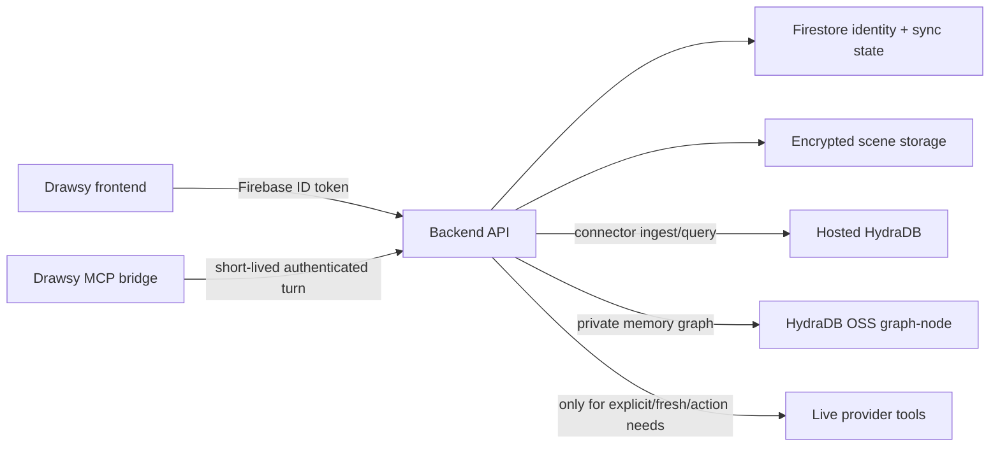
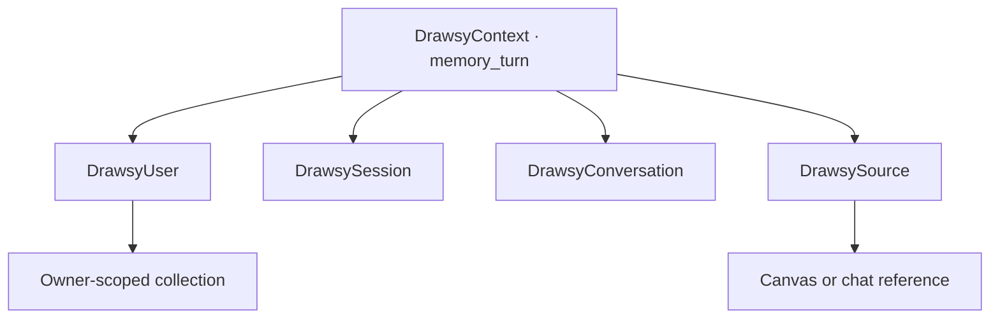

# Drawsy AI Backend — Hydra Hack

`feat-hyda-hack` is the authenticated service behind Drawsy’s Track 03 build.
It owns identity, connector authorization and sync, Hydra retrieval, and the
private memory boundary. The browser never receives Hydra or provider
credentials.

<p align="center">
  <a href="https://github.com/adarshnagrikar14/drawsy-ai/tree/feat-hyda-hack">Frontend branch</a>
  · <a href="https://github.com/adarshnagrikar14/drawsy-ai-mcp/tree/feat-hyda-hack">MCP branch</a>
  · <a href="https://github.com/hydra-db/hydradb">HydraDB OSS</a>
  · <a href="https://docs.hydradb.com/get-started/v2/introduction">HydraDB v2 docs</a>
</p>

## Service role



The backend remains the browser-facing control plane. It verifies Firebase
identity, resolves the user from the token rather than from request input, and
keeps connector access behind short-lived, capability-scoped grants.

## Hydra design

Hydra is an automatic signed-in context layer, not another OAuth connector and
not a user-facing route the person has to remember.

| Path | Data | Hydra integration | Failure behavior |
| --- | --- | --- | --- |
| Personal memory | Completed signed-in turns and canvas/chat references | Official HydraDB OSS graph-node over its documented graph HTTP API | Memory can be unavailable without blocking ordinary chat |
| Connector knowledge | Normalized, syncable records from connected sources | Hosted HydraDB through `@hydradb/sdk` v2 | A source stays syncing/errored until its records are actually indexed |
| Live connector | Fresh provider reads or actions | Existing provider/remote MCP adapter with a turn grant | Used only when naturally needed or explicitly requested |

The two Hydra stores are queried in parallel. The model receives returned source
material as data, never as instructions. A missing or degraded connector does
not make private memory unavailable.

### Hydra routes

These are internal authenticated service contracts used by the Drawsy MCP
bridge. They do not compel a user action or require an `@Hydra` tag.

- `GET /v1/hydra/status` — signed-in availability, memory state, connector
  readiness, per-source progress, and last error.
- `POST /v1/hydra/query` — user-scoped memory and indexed connector retrieval.
- `POST /v1/hydra/turns` — idempotent write of a completed signed-in turn and
  canvas/source references.
- `DELETE /v1/hydra/memory` — delete selected personal memory records.

Every protected request uses:

```http
Authorization: Bearer <firebase-id-token>
```

The backend derives the owner from the verified token. Anonymous requests do
not receive personal memory or connector knowledge.

## Personal memory graph

The OSS path stores graph relationships instead of a flat prompt dump:



Memory writes use deterministic IDs and `MERGE`-style upserts. Retrying the same
event key updates the same graph record. Retrieval is global within the
authenticated user boundary, so a later canvas can use an earlier canvas’s
decision without leaking it across users or forcing a canvas filter.

## Connector knowledge sync

The connector pipeline is deliberately stateful and readiness-gated:

1. The user connects a provider through the existing OAuth or guided setup
   flow.
2. The backend enumerates the provider’s syncable capabilities.
3. Each capability is normalized into bounded knowledge records with provider,
   account, capability, source, and owner metadata.
4. Records are upserted into the user’s hosted HydraDB collection using stable
   identities; retries do not multiply records.
5. The backend reports progress per connector and capability in Firestore.
6. Only a source with completed records and successful indexing is returned as
   ready Hydra connector context.

Current adapters include Google Workspace (Mail, Calendar, Drive), Notion,
GitHub, Read AI, Fireflies, AWS inventory, and Slack where configured. A
provider that is unsupported, rate-limited, missing a resource, or still
indexing stays visible as an operational state; it is not silently counted as
usable knowledge.

Live provider reads remain separate. A live result is returned as a live
provider result, not retroactively labelled as a Hydra source.

## Connector authorization

- OAuth credentials and refresh tokens remain server-side and encrypted.
- The MCP bridge receives a short-lived grant bound to the authenticated user,
  session, turn, connection, and capability allowlist.
- Provider responses are validated, bounded, and normalized before reaching the
  model.
- Read AI and Fireflies use their official remote Streamable HTTP MCP servers
  with OAuth and read-only tool filtering.
- GitHub uses a read-only GitHub App installation.
- AWS is inventory-only through the guided cross-account role; it does not
  expose application data or AWS writes.

Provider registration and callback settings are in the env example file. Use
HTTPS callback URLs and a deployment secret manager outside local development.

## Local setup

Requirements:

- Node.js 22 or newer
- owned Firebase project access and Google Application Default Credentials
- a local HydraDB OSS graph-node following the current upstream instructions

```bash
git clone --branch feat-hyda-hack https://github.com/adarshnagrikar14/drawsy-ai-backend.git
cd drawsy-ai-backend
cp .env.example .env
npm install
npm run dev
```

Start the official [HydraDB OSS repository](https://github.com/hydra-db/hydradb)
according to its current [AGENTS guide](https://docs.hydradb.com/AGENTS) and
[v2 introduction](https://docs.hydradb.com/get-started/v2/introduction). Keep
the local graph endpoint on loopback. The backend’s local defaults are:

### Drawsy HydraDB fork

The local graph-node used for this build comes from the [Drawsy HydraDB fork](https://github.com/adarshnagrikar14/hydradb).
The fork is based on upstream `6a2fbb1` and its published history currently
contains eight Drawsy-authored commits through `5f6ca14`. The relevant changes
are real runtime changes, not README-only attribution:

- `ConditionalLocalFileSystem` implements checked local SlateDB updates and
  serializes the local manifest/checkpoint replacement path;
- the shard write pipeline skips oversized property-index keys while retaining
  the full long value in vertex/edge metadata, which matters for conversation
  records; and
- graph-node startup/readiness, HTTP telemetry, cluster/placement, and test
  updates keep the local OSS node observable and runnable.

The [fork diff](https://github.com/adarshnagrikar14/hydradb/compare/6a2fbb192f37f51a93690a2ae2d2f5e27e6e4219...5f6ca146e2789234e231f228ca180689f991d1af)
and [local object-store commit](https://github.com/adarshnagrikar14/hydradb/commit/e594d8b37d7611ba1ed08c3a96db4030a46e49ca)
are the source evidence. Cloud object stores still use HydraDB’s upstream
path; this adapter is deliberately limited to local single-node development.
The fork retains HydraDB’s AGPL-3.0 license and is deployed as a separate OSS
graph service, not rebranded as Drawsy backend code.

```dotenv
HYDRA_ENABLED=true
HYDRA_MEMORY_BASE_URL=http://127.0.0.1:18443
HYDRA_MEMORY_NAMESPACE=local
HYDRA_MEMORY_GRAPH_ID=default
HYDRA_MEMORY_CELL_ID=cell-0
```

Set the server-only values for hosted connector knowledge and local memory in
the env file; never commit them:

```dotenv
HYDRA_HOSTED_API_KEY=
HYDRA_HOSTED_DATABASE=
HYDRA_HOSTED_BASE_URL=https://api.hydradb.com
HYDRA_MEMORY_AUTH_TOKEN=
```

`HYDRA_ENABLED` gates the Hydra router and sync worker. The older `HYDRA_DB_*`
names are accepted only as migration aliases. `APP_ALLOWED_ORIGINS` must list
the exact frontend origins used for local or hosted deployment; do not use a
wildcard when credentials are enabled.

## Commands

```bash
npm run format:check
npm run lint
npm run typecheck
npm test
npm run build
npm start
```

The complete environment reference is [the env example](./.env.example). It
includes Firebase, R2, connector OAuth, grant, CORS, sync, retry, timeout, and
encryption settings. No service-account file, provider secret, R2 credential,
or Hydra key belongs in this repository.

## Evaluation

The full methodology and released-data commands live in
[`docs/HYDRA_EVALUATION.md`](https://github.com/adarshnagrikar14/drawsy-ai-backend/blob/feat-hyda-hack/docs/HYDRA_EVALUATION.md).

### Product acceptance

Run with the local OSS graph-node available:

```bash
npm run eval:hydra-memory
```

This gate checks cross-session synthesis, chronology, abstention, idempotent
retry behavior, user isolation, and query latency. It is a disposable
integration acceptance test, not a synthetic substitute for the official
benchmarks.

### Official memory evaluation

Use the released datasets only:

- [LongMemEval](https://github.com/xiaowu0162/LongMemEval)
- [LongMemEval-V2](https://github.com/xiaowu0162/LongMemEval-V2)
- [BEAM](https://github.com/mohammadtavakoli78/BEAM)

The adapters stream into disposable owner-scoped collections, checkpoint
progress, and report the metric appropriate to each release. LongMemEval can
report exact evidence recall because its questions identify answer sessions.
V2 and BEAM report retrieval latency and gold-answer token support unless a
separate model reader is supplied; they are not silently presented as official
end-to-end QA accuracy.

### Real connector evaluation

```bash
npm run eval:hydra-connectors
```

This reads the current signed-in user’s persisted sync state and queries hosted
Hydra through the production client. It never calls live providers during the
test. Only sources that are `ready` with submitted/indexed records are counted;
syncing, errored, rate-limited, or pending-indexing sources are reported and
excluded. Re-run immediately before recording evidence because the result
depends on live connector readiness.

## Submission and OSS note

Hack Hydra Track 03 asks for an original project built during Aug 12–20, 2026,
meaningful use of the HydraDB OSS repository, an inspectable open-source
repository, a short demo video, and the [official submission form](https://forms.gle/WEwqEmmN7Bkp4HyJ6).
For this service, show:

- the OSS graph writes and reads for signed-in memory;
- the hosted Hydra v2 ingestion/query path for connector knowledge;
- idempotent sync and readiness-gated connector status;
- parallel memory/connector retrieval with graceful degradation; and
- the user-facing source metadata emitted for Hydra context.

The backend repository is currently access-controlled and has no license grant
through private repository access. Before submitting it as a public repository,
complete the security review, remove deployment-only material, publish an
explicit OSI-approved license, and use the `feat-hyda-hack` branch URL.

## Related implementation

- [Drawsy frontend — `feat-hyda-hack`](https://github.com/adarshnagrikar14/drawsy-ai/tree/feat-hyda-hack)
- [Drawsy MCP — `feat-hyda-hack`](https://github.com/adarshnagrikar14/drawsy-ai-mcp/tree/feat-hyda-hack)
- [HydraDB OSS](https://github.com/hydra-db/hydradb)
- [HydraDB AGENTS](https://docs.hydradb.com/AGENTS)
- [HydraDB v2 introduction](https://docs.hydradb.com/get-started/v2/introduction)

This service does not contain frontend code, Firebase client configuration,
service-account keys, R2 credentials, or provider secrets.
